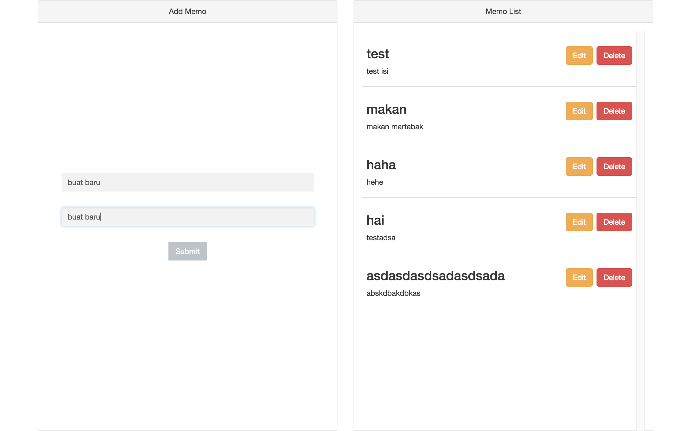
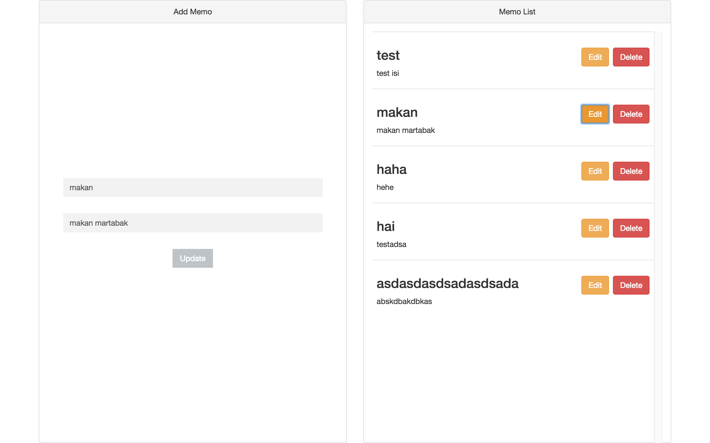

# Web API Express RESTful CRUD

## Install Express

```
npm install express-generator -g
express --ejs
npm install
```

## Install Sequelize

```
npm install sequelize-cli -g
npm install sequelize --save
sequelize init
```

## Install Sqlite3

```
npm install sqlite3 --save
```

## Setting config.json

```
"development": {
    "storage": "./db/crud_db",
    "dialect": "sqlite"
  }
```

## Screenshot

### Home

Tampilan Utama


### Insert

Isi form untuk menambah data



### Edit

Klik tombol edit untuk mengedit



### Delete

Klik tombol delete untuk menghapus

